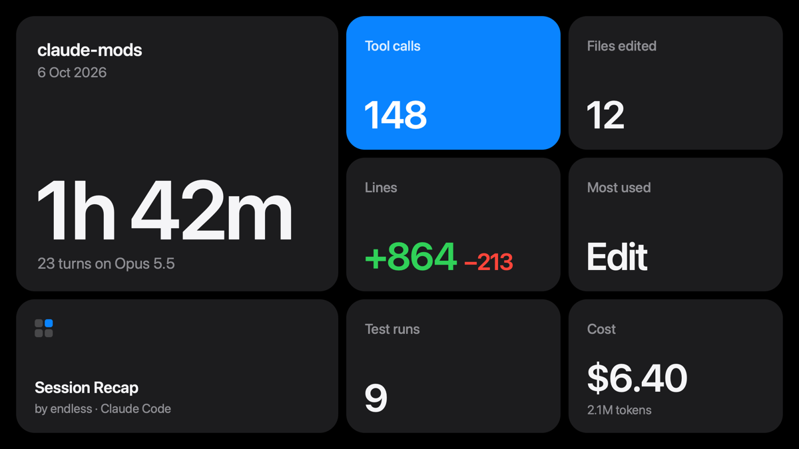

# Session Recap

When you `/clear` a conversation, a pane opens with a recap of it as a card you can share: the time Claude worked, turns, tool calls, files and lines changed, test runs and cost.



The card is drawn for the Desktop app. In the terminal the pane lists the same figures as text.

## What the card says

- **Time worked**: the time Claude spent working across your turns, not the time the session stayed open. Under it, the turns and the model.
- **Tool calls**: every tool call of the conversation, its subagents' included.
- **Files edited** and **Lines**: the files Claude edited or wrote, and the lines it added and removed. The lines are counted from what Claude wrote, so they are an estimate, not a diff.
- **Most used**: the tool called most often.
- **Test runs**: the commands that ran a test runner (vitest, jest, pytest, `go test`, `cargo test`, `bun test`, `npm test` and the like).
- **Cost**: what this conversation cost, with its tokens. On a subscription this is the API-price equivalent, not a bill.
- **Subagents**, **Skills**, **Connectors**: how many were used.

A tile with nothing to say gives its place to the next one, so a card never shows a zero: a research conversation shows subagents and connectors where a build shows files and lines. The card names the project by its folder and never shows a file name or a path.

## Using it

- `/clear` opens the recap of the conversation you just cleared, once it had at least one turn. Esc closes it.
- `/session-recap` shows the conversation so far without clearing it, or the last recap again when the new conversation has not started.
- **Copy image** puts the card on the clipboard as a 2400 × 1350 PNG. **Save image** writes it to `~/Pictures/Session Recaps` and shows it in the Finder. Both need macOS: the image is drawn by Quick Look, so it is set in the system typeface with nothing to install.

## Install

```bash
claude plugin marketplace add endless-fr/claude-mods
```

```bash
claude plugin install session-recap@endless-claude-mods
```

Run `/reload-plugins` in a session that is already open. Requires Claude Code v2.1.287 or later in the terminal, v2.1.286 or later in the Desktop app.

## What it reads and keeps

The mod makes no network requests, calls no model and sends nothing anywhere.

- **Reads**: each tool call's name and, for an edit, its file path and the text it replaced and wrote; for a Bash call, its command, to tell a test run; each main-conversation request's token counts; each turn's length; the session's cost; the working directory's name.
- **Keeps**, for the session only: the running counts and the last recap. Nothing is written to disk until you press a button.
- **Runs**, only when you press **Copy image** or **Save image**: `qlmanage` and `sips` to draw the image, `osascript` to copy it, `mkdir`, `cp` and `open` to save and show it, `rm` to remove its working files from the temporary folder.
- **Hooks `/clear`**, to open the pane once the command has run. It changes nothing about what `/clear` does.

To list this yourself before installing, run `claude plugin validate mods/session-recap` from a clone.

## Develop

```bash
claude plugin validate mods/session-recap
```

```bash
claude plugin test mods/session-recap
```

The counting and the choice of tiles live in [hooks/stats.ts](hooks/stats.ts), the drawing in [hooks/card.ts](hooks/card.ts) and the image commands in [hooks/export.ts](hooks/export.ts), all three free of any engine call. [hooks/register.tsx](hooks/register.tsx) wires them to the session and runs the commands.

## Credits

Inspired by OneWave AI's [session-wrapped](https://github.com/OneWave-AI/claude-code-mods/tree/main/session-wrapped). Session Recap is written from scratch and shares no code with it.
